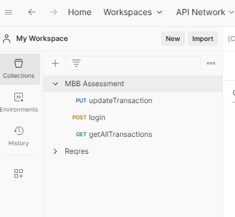

# Getting Started

### Start MSSQL Server Container
Install Docker Desktop, then run docker compose:
```
# Windows
cd src\main\docker

docker-compose -f .\docker-compose.yml up -d
```

### Setup DB
1. Connect using SQL Server Management Studio


2. Create "mbb_assessment" database


### Start Application
1. Open mbb-java project in IntelliJ IDEA, then click `MbbJavaApplication`
 


### Import Postman Collection
1. Import postman_collection.json


